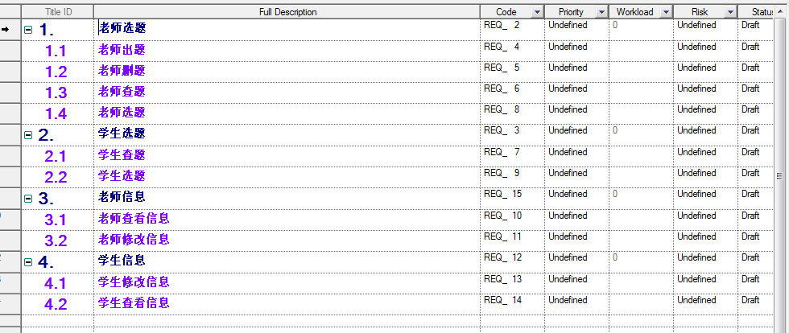
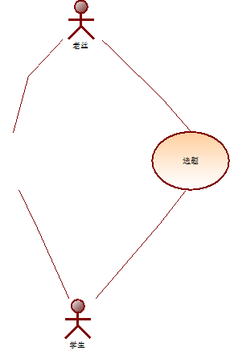
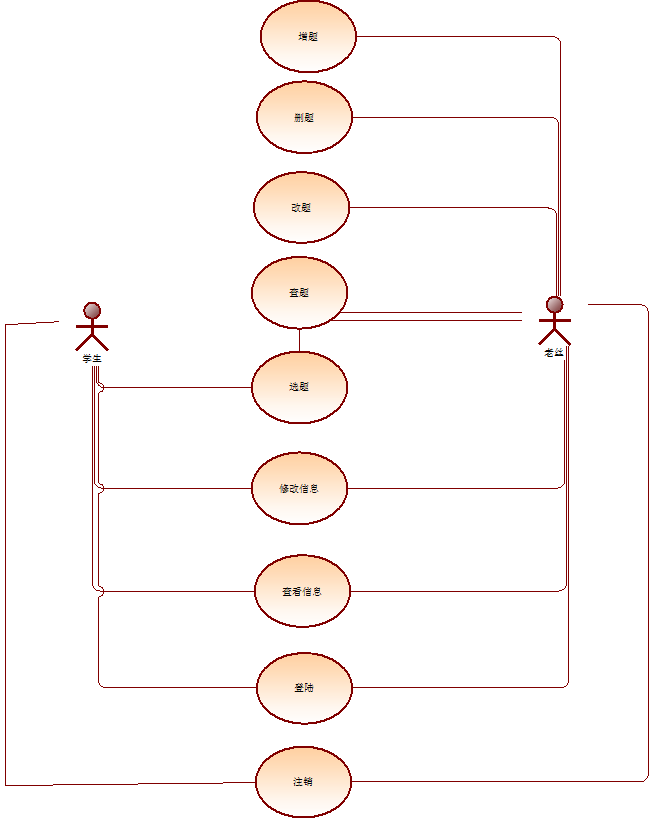
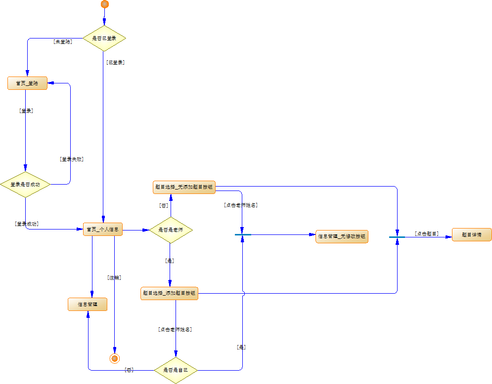
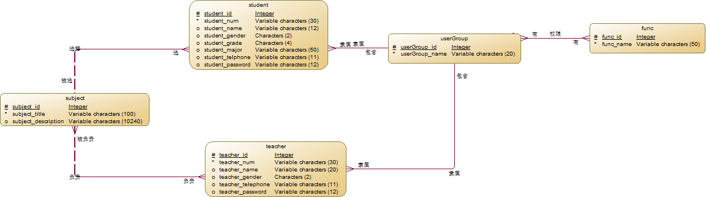
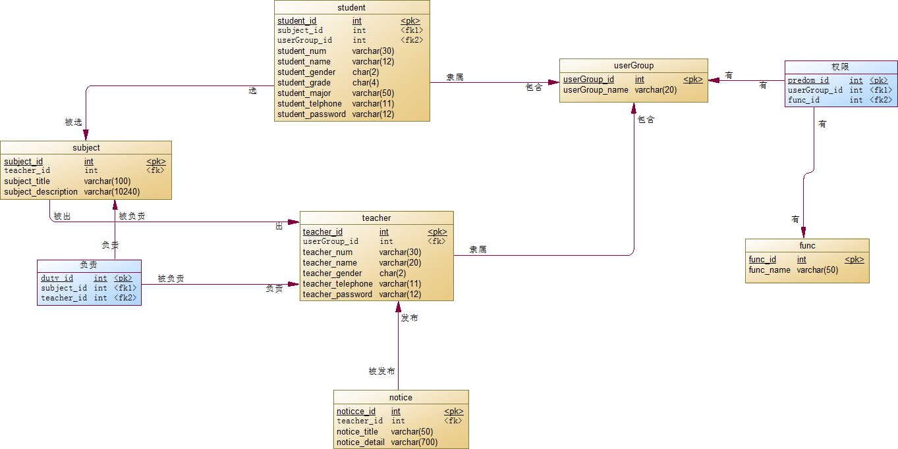

A **CMS** System. Graduate Design Management System is a management system aimed at graduates need to design. It’s convenient for college graduates and graduate view about graduation design at any time, and to choose a topic of graduation design. 

Test Accouts:<Br>
username 12310320304 password 123123 (*student*)<br>
username 611033 password 123123 (*teacher*)
SQL DDL
-----

```
CREATE DATABASE  IF NOT EXISTS `graduationsystem` /*!40100 DEFAULT CHARACTER SET utf8 */;
USE `graduationsystem`;
-- MySQL dump 10.13  Distrib 5.6.13, for Win32 (x86)
--
-- Host: zyl-me.xicp.net    Database: graduationsystem
-- ------------------------------------------------------
-- Server version	5.5.40-0ubuntu0.12.04.1

/*!40101 SET @OLD_CHARACTER_SET_CLIENT=@@CHARACTER_SET_CLIENT */;
/*!40101 SET @OLD_CHARACTER_SET_RESULTS=@@CHARACTER_SET_RESULTS */;
/*!40101 SET @OLD_COLLATION_CONNECTION=@@COLLATION_CONNECTION */;
/*!40101 SET NAMES utf8 */;
/*!40103 SET @OLD_TIME_ZONE=@@TIME_ZONE */;
/*!40103 SET TIME_ZONE='+00:00' */;
/*!40014 SET @OLD_UNIQUE_CHECKS=@@UNIQUE_CHECKS, UNIQUE_CHECKS=0 */;
/*!40014 SET @OLD_FOREIGN_KEY_CHECKS=@@FOREIGN_KEY_CHECKS, FOREIGN_KEY_CHECKS=0 */;
/*!40101 SET @OLD_SQL_MODE=@@SQL_MODE, SQL_MODE='NO_AUTO_VALUE_ON_ZERO' */;
/*!40111 SET @OLD_SQL_NOTES=@@SQL_NOTES, SQL_NOTES=0 */;

--
-- Table structure for table `duty`
--

DROP TABLE IF EXISTS `duty`;
/*!40101 SET @saved_cs_client     = @@character_set_client */;
/*!40101 SET character_set_client = utf8 */;
CREATE TABLE `duty` (
  `subject_id` int(11) NOT NULL,
  `teacher_id` int(11) NOT NULL,
  PRIMARY KEY (`subject_id`,`teacher_id`),
  KEY `FK_被负责` (`teacher_id`),
  CONSTRAINT `FK_被负责` FOREIGN KEY (`teacher_id`) REFERENCES `teacher` (`teacher_id`),
  CONSTRAINT `FK_负责` FOREIGN KEY (`subject_id`) REFERENCES `subject` (`subject_id`)
) ENGINE=InnoDB DEFAULT CHARSET=utf8;
/*!40101 SET character_set_client = @saved_cs_client */;

--
-- Table structure for table `func`
--

DROP TABLE IF EXISTS `func`;
/*!40101 SET @saved_cs_client     = @@character_set_client */;
/*!40101 SET character_set_client = utf8 */;
CREATE TABLE `func` (
  `func_id` int(11) NOT NULL AUTO_INCREMENT,
  `func_name` varchar(50) NOT NULL,
  PRIMARY KEY (`func_id`)
) ENGINE=InnoDB AUTO_INCREMENT=2 DEFAULT CHARSET=utf8;
/*!40101 SET character_set_client = @saved_cs_client */;

--
-- Table structure for table `predom`
--

DROP TABLE IF EXISTS `predom`;
/*!40101 SET @saved_cs_client     = @@character_set_client */;
/*!40101 SET character_set_client = utf8 */;
CREATE TABLE `predom` (
  `userGroup_id` int(11) NOT NULL,
  `func_id` int(11) NOT NULL,
  PRIMARY KEY (`userGroup_id`,`func_id`),
  KEY `FK_有2` (`func_id`),
  CONSTRAINT `FK_有` FOREIGN KEY (`userGroup_id`) REFERENCES `usergroup` (`userGroup_id`),
  CONSTRAINT `FK_有2` FOREIGN KEY (`func_id`) REFERENCES `func` (`func_id`)
) ENGINE=InnoDB DEFAULT CHARSET=utf8;
/*!40101 SET character_set_client = @saved_cs_client */;

--
-- Table structure for table `student`
--

DROP TABLE IF EXISTS `student`;
/*!40101 SET @saved_cs_client     = @@character_set_client */;
/*!40101 SET character_set_client = utf8 */;
CREATE TABLE `student` (
  `student_id` int(11) NOT NULL AUTO_INCREMENT,
  `subject_id` int(11) DEFAULT NULL,
  `userGroup_id` int(11) NOT NULL,
  `student_num` varchar(30) NOT NULL,
  `student_name` varchar(12) DEFAULT NULL,
  `student_gender` char(2) DEFAULT NULL,
  `student_grade` char(4) DEFAULT NULL,
  `student_major` varchar(50) DEFAULT NULL,
  `student_telphone` varchar(11) DEFAULT NULL,
  `student_password` varchar(12) DEFAULT NULL,
  PRIMARY KEY (`student_id`),
  UNIQUE KEY `num_UQ` (`student_num`),
  KEY `FK_belong` (`userGroup_id`),
  KEY `FK_select` (`subject_id`),
  CONSTRAINT `FK_belong` FOREIGN KEY (`userGroup_id`) REFERENCES `usergroup` (`userGroup_id`),
  CONSTRAINT `FK_select` FOREIGN KEY (`subject_id`) REFERENCES `subject` (`subject_id`)
) ENGINE=InnoDB AUTO_INCREMENT=3 DEFAULT CHARSET=utf8;
/*!40101 SET character_set_client = @saved_cs_client */;

-- Table structure for table `subject`
--

DROP TABLE IF EXISTS `subject`;
/*!40101 SET @saved_cs_client     = @@character_set_client */;
/*!40101 SET character_set_client = utf8 */;
CREATE TABLE `subject` (
  `subject_id` int(11) NOT NULL AUTO_INCREMENT,
  `subject_title` varchar(100) NOT NULL,
  `subject_description` varchar(10240) DEFAULT NULL,
  PRIMARY KEY (`subject_id`)
) ENGINE=InnoDB AUTO_INCREMENT=17 DEFAULT CHARSET=utf8;
/*!40101 SET character_set_client = @saved_cs_client */;

--
-- Table structure for table `teacher`
--

DROP TABLE IF EXISTS `teacher`;
/*!40101 SET @saved_cs_client     = @@character_set_client */;
/*!40101 SET character_set_client = utf8 */;
CREATE TABLE `teacher` (
  `teacher_id` int(11) NOT NULL AUTO_INCREMENT,
  `userGroup_id` int(11) NOT NULL,
  `teacher_num` varchar(30) NOT NULL,
  `teacher_name` varchar(20) DEFAULT NULL,
  `teacher_gender` char(2) DEFAULT NULL,
  `teacher_telephone` varchar(11) DEFAULT NULL,
  `teacher_password` varchar(12) DEFAULT NULL,
  PRIMARY KEY (`teacher_id`),
  UNIQUE KEY `num_UQ` (`teacher_num`),
  KEY `FK_belong2` (`userGroup_id`),
  CONSTRAINT `FK_belong2` FOREIGN KEY (`userGroup_id`) REFERENCES `usergroup` (`userGroup_id`)
) ENGINE=InnoDB AUTO_INCREMENT=8 DEFAULT CHARSET=utf8;
/*!40101 SET character_set_client = @saved_cs_client */;

--
-- Table structure for table `usergroup`
--

DROP TABLE IF EXISTS `usergroup`;
/*!40101 SET @saved_cs_client     = @@character_set_client */;
/*!40101 SET character_set_client = utf8 */;
CREATE TABLE `usergroup` (
  `userGroup_id` int(11) NOT NULL AUTO_INCREMENT,
  `userGroup_name` varchar(20) NOT NULL,
  PRIMARY KEY (`userGroup_id`)
) ENGINE=InnoDB AUTO_INCREMENT=3 DEFAULT CHARSET=utf8;
/*!40101 SET character_set_client = @saved_cs_client */;

--
```

Diagram
------
**需求模型**:<br><br>

**业务用例**:<br><br>

**系统用例**:<br><br>

**活动图**:<br><br>

**概念数据模型**:<br><br>

**物理数据模型**:<br><br>
